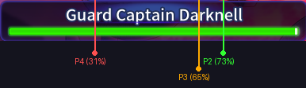

# MapleStory M - Guard Captain Darknell Helper

A real-time, transparent desktop HUD overlay designed to assist MapleStory M players in tracking Guard Captain Darknell's attack patterns and rotations. The helper runs locally, utilizes offline voice recognition (Vosk) to advance boss moves/handle stun-skips, and automatically tracks HP bar levels to transition boss phases.

---

## ✨ Features

- **🎮 Glassmorphic HUD Overlay**: A floating, stays-on-top, click-through overlay displaying the full scrolling rotation, locking the next expected move at the very top (highlighted in cyan with a `➔` pointer). Backed by a semi-transparent panel for legibility.
- **🎙️ Offline Voice Commands (Vosk)**: Hands-free sequence progression. Toggles between:
  - **Shotcaller Mode**: Listens to microphone input (for players making the callouts).
  - **Listener Mode**: Listens to speaker loopback input (WASAPI loopback) to track a teammate's callouts without recording your own microphone, avoiding double-skips.
- **⚡ Stun-Skip & Sequence Resync**:
  - **Stun Skip**: When Darknell gets stunned and skips moves, say `"stun"` or `"stunned"` followed by the move he is performing to skip. Normal out-of-order commands are ignored to prevent noise-based skips.
  - **Sequence Sync**: Say a multi-move pattern (e.g. `"Dive into Meteor"`) to perform a phase-wide lookahead scan, resynchronizing the rotation engine automatically.
- **🔍 Active HP Tracking**: Auto-detects boss phases (Phase 1, 2, 3, 4) by sampling the HP bar width.
  - **Auto-Cropping Leniency**: Automatically finds the exact bounds of the nameplate box within the calibrated region, absorbing user margin drawing errors.
  - **No-OCR Green Density Scanning**: Runs a vertical pixel-density hue scanner that is immune to centered text overlays ("Guard Captain Darknell"), resolution scaling, or accidental click calibrations.
  - **Lobby/Death Detection**: Detects if you are in a lobby, loading screen, or town, and pauses tracking automatically until the green HP bar appears.
  - **Phase Transition Boundaries**: Checked dynamically at 35% (in the "d" of Guard), 65% (between "ar" in Darknell), and 75% (in the "e" of Darknell) of the nameplate width (visualized on the calibration image in the Setup section below).
- **⌨️ System-Wide Global Hotkey**: Press `Ctrl+Shift+U` at any time (even while in-game) to toggle between **HUD Mode** (click-through, stays-on-top) and **Setup Mode** (draggable, buttons and audio configurations active).

---

## 🛠️ Prerequisites

- **Operating System**: Windows 10 or 11 (requires Windows GDI for desktop capture).
- **Python**: Python 3.10 to 3.13.

---

## 📦 Installation

1. **Clone or Download** this repository to a folder on your local machine:
   ```bash
   git clone https://github.com/jasonwliu/darknell_callouts.git
   cd darknell_callouts
   ```

2. **Install Dependencies**:
   Open a terminal in the folder and run:
   ```bash
   pip install -r requirements.txt
   ```
   *Required packages: `PyQt6`, `sounddevice`, `pyaudiowpatch`, `vosk`, `pillow`, `numpy`, `keyboard`, `winocr`.*

3. **Vosk Speech Model (Automatic)**:
   On first startup, if the Vosk speech recognition model directory is missing, the application will automatically download the lightweight English voice model (`model-en-us-0.22-lgroup` or similar) in the background.

---

## 🚀 Running the App

Double-click the **`run_helper.bat`** file located in the project folder. This opens a terminal window in your active desktop session (Session 1), allowing the screen capture thread to read the HP bar values.

---

## ⚙️ Initial Setup & Calibration

Upon launching the application:
1. The app starts in **Setup Mode** (opaque container box with borders and controls).
2. **Select Mode & Audio Device**:
   - Choose between **Shotcaller (Mic)** (to input commands via your microphone) or **Listener (Loopback)** (to register team callouts directly from your speaker output).
   - Select your corresponding audio device from the dropdown.
3. **Calibrate HP Region**:
   - Open MapleStory M (configured in windowed or borderless windowed mode).
   - In the helper app, click **Calibrate Region**.
   - Your screen will dim. Click and drag a box enclosing the **entire boss name and HP bar container** at the top center of your game window. You should drag the selection box to cover the entire purple nameplate border and the green HP bar directly below it (as shown in the `hp_bar_clean.png` diagram below). Extra margin padding is handled automatically by the nameplate detection scanner.
     
     **Example of a correct calibration region selection:**
     
     
     
   - Release the mouse. The coordinates will save persistently to `config.json`.
4. **Lock & Play**:
   - Press `Ctrl+Shift+U` to lock the overlay into **HUD Mode**.
   - The configuration controls will hide, the background will become a translucent dark panel, and clicks will pass straight through the HUD to the game window.

---

## 📊 HP Phase Transitions

The active HP tracker automatically tracks boss HP and transitions phases. It does this by checking green pixel density at specific percentage columns of the nameplate width. 

Refer to the diagram below to see exactly where the boundaries align:



- **Phase 1 (100% - 75% HP)**: Initial phase.
- **Phase 2 (75% - 65% HP)**: Starts once the green HP drops past **75%** (positioned exactly in the `"e"` in `"Darknell"`).
- **Phase 3 (65% - 35% HP)**: Starts once the green HP drops past **65%** (positioned exactly between the `"a"` and `"r"` in `"Darknell"`).
- **Phase 4 (35% - 0% HP)**: Starts once the green HP drops past **35%** (positioned exactly in the `"d"` in `"Guard"`).

---

## 🗣️ Spoken Commands Reference

| Voice Command | Action | Description |
| :--- | :--- | :--- |
| **"Meteor"** | Advance move | Confirms Darknell completed a Meteor attack. |
| **"Push"** | Advance move | Confirms Darknell completed a Push attack. |
| **"Buff"** | Advance move | Confirms Darknell completed a Buff cast. |
| **"Dash"** | Advance move | Confirms Darknell completed a Dash. |
| **"Dive"** | Advance move | Confirms Darknell completed a Dive. |
| **"Charge"** / **"Shock"** / **"Shockwave"** | Advance move | Confirms Darknell completed a Charge (P2/P3/P4). |
| **"Stun [Move]"** or **"Stunned [Move]"** | Stun Skip | Skips forward in the rotation to the spoken move (e.g. `"Stun Push"`). Out-of-order calls without this prefix are ignored to prevent noise skips. |
| **[Pattern Sequence]** | Sequence Sync | Speak a sequence of 2-3 moves (e.g. `"Dive into Meteor"`) to auto-sync the tracker to that position in the rotation. |
| **"Phase One"** / **"P1"** | Manual Override | Sets the HUD sequence to Phase 1. |
| **"Phase Two"** / **"P2"** | Manual Override | Sets the HUD sequence to Phase 2. |
| **"Phase Three"** / **"P3"** | Manual Override | Sets the HUD sequence to Phase 3. |
| **"Phase Four"** / **"P4"** | Manual Override | Sets the HUD sequence to Phase 4. |
| **"Reset"** | Reset rotation | Restarts the current phase rotation back to move index 0. |

---

## 🗂️ Project Directory Structure

```
darknell_callouts/
│
├── config.py           # Persistent configuration loader/writer (config.json)
├── rotation.py         # Rotation sequence mappings, stun skip, and pattern rules
├── voice.py            # Offline Vosk audio capture loop QThread
├── screen_tracker.py   # Green HP bar pixel-density tracking QThread
├── overlay.py          # PyQt6 Glassmorphic click-through HUD & calibration windows
├── main.py             # System hooks, initialization, and thread connectors
│
├── run_helper.bat      # Windows batch launcher (runs app in Session 1)
├── diagnose.py         # Troubleshooting tool to check OCR and pixel checkpoints
├── test_rotation.py    # Pytest test suite proving skips/transitions (12/12 passing)
├── requirements.txt    # Python library requirements list
└── README.md           # Documentation (this file)
```

---

## 🔧 Troubleshooting

### HP Detection Is Not Updating Phases
- **Run direct, not via remote shell**: Ensure you are starting the app by double-clicking `run_helper.bat` or executing `python main.py` in your terminal directly. If run under service managers or remote shells, Windows blocks Session 0 screenshots.
- **Recalibrate**: If the MapleStory M window is moved or resized, press `Ctrl+Shift+U` to unlock, click **Calibrate Region**, and drag a tight box over the HP bar header again.
- **Run Diagnostics**: Close the helper app, open a command prompt in the directory, and run:
  ```bash
  python diagnose.py
  ```
  Check the generated `debug_hp_bar.png` to confirm that the captured region aligns with the game window's HP bar.

### Voice Commands Not Recognized
- Confirm the correct microphone device is selected in Setup Mode.
- Speak clearly into the microphone. Since the recognizer is offline, it performs best when microphone gain is balanced and background noise is minimal.
